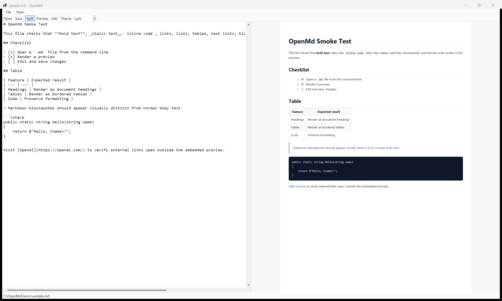
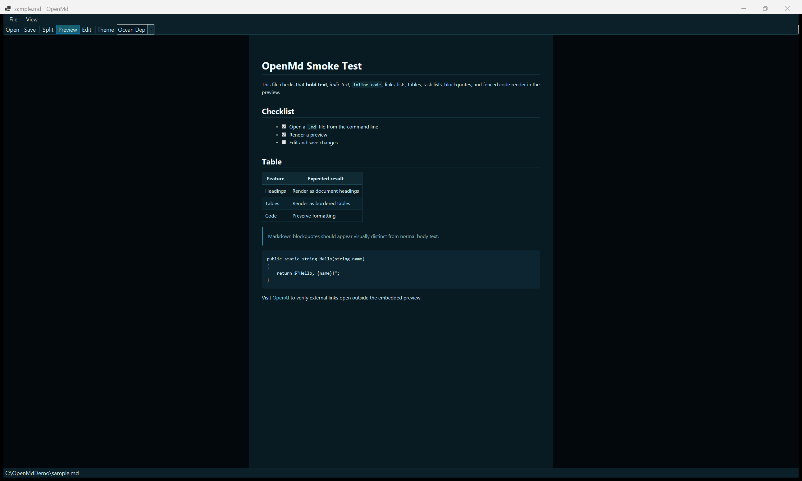

# OpenMd

OpenMd is a small Windows Markdown viewer/editor. It can be registered as the current user's `.md` file opener and accepts a Markdown path from Explorer:

```powershell
OpenMd.exe "C:\path\to\file.md"
```

It includes multiple app-wide themes: Light, Dark, Evergreen, Midnight, Graphite, Ocean Depth, Terminal, OLED Black, Solarized Dark, High Contrast, Sepia, and Solarized. Pick one from `View > Theme` or the toolbar theme selector.

## Screenshots

| Split editor and live preview | Ocean Depth preview |
| --- | --- |
|  |  |

## Build

```powershell
dotnet publish .\OpenMd\OpenMd.csproj -c Release -r win-x64 --self-contained false
```

The executable is written to:

```text
OpenMd\bin\Release\net9.0-windows\win-x64\publish\OpenMd.exe
```

## Register as the `.md` opener

After publishing, run:

```powershell
powershell -ExecutionPolicy Bypass -File .\tools\Register-OpenMd.ps1
```

Windows 10/11 may keep an existing protected default-app choice. If that happens, pick `OpenMd.exe` in Settings > Apps > Default apps > `.md`.
